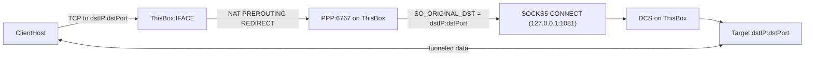

## Non-local Transparent Proxy (Transit Capture) - Step-by-step

### What you’ll achieve
Route TCP traffic from other machines through this box, transparently proxy it via PPP → DCS → target, without apps knowing.

### High-level flow



---

### Prerequisites
- This box must be on-path for clients (default gateway or inline bridge).
- PPP (`src/socks5_ppp.py`) listening on a single ingress port (e.g., 6767).
- DCS (`src/socks5_dcs.py`) running on 127.0.0.1:1081 (no auth assumed).
- Linux kernel iptables (nft or legacy backend) and admin rights.

---

### 1) Enable IPv4 forwarding (router mode)

```bash
sudo sysctl -w net.ipv4.ip_forward=1
# Persist (optional):
# echo "net.ipv4.ip_forward = 1" | sudo tee /etc/sysctl.d/99-forward.conf && sudo sysctl --system
```

---

### 2) Start DCS and PPP

- DCS:
```bash
python3 /mnt/c/code/VSG/socks_proxy/src/socks5_dcs.py
```
- PPP:
```bash
python3 /mnt/c/code/VSG/socks_proxy/src/socks5_ppp.py
```

Alternatively, use the provided systemd unit for PPP:
```bash
sudo cp /mnt/c/code/VSG/socks_proxy/systemd/ppp-transparent.service /etc/systemd/system/
sudo systemctl daemon-reload
sudo systemctl enable --now ppp-transparent
```

---

### 3) Add NAT PREROUTING rules (transit capture)

Pick the ingress interface (where client traffic arrives):
```bash
IFACE=$(ip route get 1.1.1.1 | awk '/dev/{print $5}')
```

Redirect selected destination IP:port pairs into PPP’s ingress port (6767 by default). Examples:
```bash
LISTEN_PORT=6767
sudo iptables -t nat -A PREROUTING -i "$IFACE" -p tcp -d 172.23.16.1 --dport 7978 -j REDIRECT --to-ports "$LISTEN_PORT"
sudo iptables -t nat -A PREROUTING -i "$IFACE" -p tcp -d 104.154.249.83 --dport 8891 -j REDIRECT --to-ports "$LISTEN_PORT"
```

Safety notes (strongly recommended):
- Do NOT redirect to DCS port (1081) or PPP port (6767) again (avoid loops).
- Keep OUTPUT rules if you also want to capture this box’s own traffic (local capture).

If this box is also the NAT gateway to the Internet, ensure MASQUERADE (as applicable):
```bash
# Example if you also SNAT egress
# WAN_IFACE=...
# sudo iptables -t nat -A POSTROUTING -o "$WAN_IFACE" -j MASQUERADE
```

---

### 4) (Optional) Keep local OUTPUT capture
If you also want to capture connections originated by this box, keep using `scripts/redirect_tcp.sh` which installs OUTPUT REDIRECTs to 6767.

---

### 5) Verify

Connectivity/services:
```bash
ss -ltnp | egrep ":6767|:1081"     # PPP and DCS listening
```
Rules and counters:
```bash
sudo iptables -t nat -L PREROUTING -n -v | egrep "REDIRECT|RETURN"
```
Generate traffic from a client (whose default gateway is this box):
```bash
# Example to target a captured destination
curl -v http://172.23.16.1:7978/ --max-time 3 || true
```
Observe PPP/DCS logs:
- PPP: should show “Using SO_ORIGINAL_DST -> 172.23.16.1:7978” and “Connected to DCS…”
- DCS: should show “New SOCKS5 client…” and “Connected to 172.23.16.1:7978, tunneling…”
- For payload-bearing tests (not just SYN/ACK), expect “DATA: … bytes” lines.

If your target isn’t HTTP, test with netcat:
```bash
printf 'ping\n' | nc -w2 172.23.16.1 7978 || true
```

---

### 6) Persistence
- iptables: save/restore via your distro mechanism (e.g., `iptables-save` + system service, or use `nft` rules if you prefer modern nftables).
- systemd: use `ppp-transparent.service` for PPP; create a similar service for DCS if needed.

---

### 7) Optional: Prioritize bandwidth
Mark DCS outbound flows by DSCP and shape with `tc` HTB on the WAN interface (class per DSCP). Example outline:
```bash
IFACE=$(ip route get 1.1.1.1 | awk '/dev/{print $5}')
sudo tc qdisc add dev "$IFACE" root handle 1: htb default 20
sudo tc class add dev "$IFACE" parent 1: classid 1:1 htb rate 100mbit
sudo tc class add dev "$IFACE" parent 1:1 classid 1:10 htb rate 50mbit ceil 100mbit
sudo tc class add dev "$IFACE" parent 1:1 classid 1:20 htb rate 30mbit ceil 100mbit
sudo tc class add dev "$IFACE" parent 1:1 classid 1:30 htb rate 10mbit ceil 100mbit
sudo tc qdisc add dev "$IFACE" parent 1:10 fq_codel
sudo tc qdisc add dev "$IFACE" parent 1:20 fq_codel
sudo tc qdisc add dev "$IFACE" parent 1:30 fq_codel

# Mark by destination
sudo iptables -t mangle -A OUTPUT -p tcp -d 172.23.16.1 --dport 7978 -j DSCP --set-dscp-class AF41
sudo iptables -t mangle -A OUTPUT -p tcp -d 104.154.249.83 --dport 8891 -j DSCP --set-dscp-class CS1

# Map DSCP to classes (TOS match)
sudo tc filter add dev "$IFACE" protocol ip parent 1: prio 1 u32 match ip tos 0x88 0xfc flowid 1:10  # AF41
sudo tc filter add dev "$IFACE" protocol ip parent 1: prio 2 u32 match ip tos 0x20 0xfc flowid 1:30  # CS1
```

---

### Troubleshooting
- No PPP logs: PREROUTING not hit → ensure clients route via this box; verify counters increase with traffic.
- “SOCKS5 connection failed: 1” on PPP: DCS couldn’t reach the destination; check target service/network ACLs.
- curl timeouts on non-HTTP ports: the target isn’t HTTP; use netcat or proper client protocol.
- Loops: ensure you don’t redirect to 1081 or 6767 again; keep safety exclusions.

---

### Rollback
Remove the PREROUTING rules you added (replace `-A` with `-D` for identical rules), or flush carefully:
```bash
sudo iptables -t nat -S PREROUTING | awk '/REDIRECT/ { sub("-A","-D"); system("sudo iptables -t nat " $0) }'
```
Stop services if needed:
```bash
sudo systemctl stop ppp-transparent || true
# or Ctrl+C in terminals running PPP/DCS
```

---

### Notes and alternatives
- IPv6: Requires ip6tables/nft and `IP6T_SO_ORIGINAL_DST` support in code (PPP change).
- TPROXY: Alternative to REDIRECT that preserves the original destination at socket level using `IP_TRANSPARENT` (requires code to bind transparent sockets). Use only if you need advanced routing semantics.


